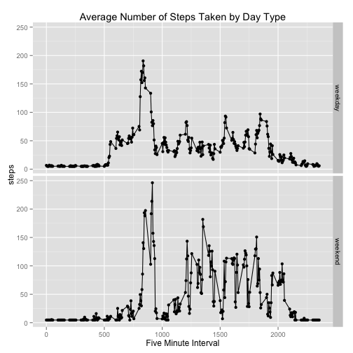

Reproducible Research - Peer Assignment # 1
========================================================
Alex Chisholm, July 2014

### A. Loading and preprocessing the data
1. Load the data (i.e. read.csv())

```r
library(stats)
setwd("~/Dropbox/Code")
data = read.csv("./rrProject1/activity.csv", header = TRUE)
```

2. Process/transform the data (if necessary) into a format suitable for your analysis

```r
data$date = as.Date(data$date, "%Y-%m-%d")
```

### B. What is mean total number of steps taken per day?
1. Make a histogram of the total number of steps taken each day


```r
stepsbyday = aggregate(steps ~ date, data = data, sum)
hist(stepsbyday$steps, main="Number of Steps Taken per Day", xlab="Total Number of Steps")
```

 

2. Calculate and report the mean and median total number of steps taken per day

```r
meanSteps = format(mean(stepsbyday$steps, na.rm = TRUE),scientific=FALSE, big.mark=',') 
medianSteps = format(median(stepsbyday$steps, na.rm = TRUE),scientific=FALSE, big.mark=',')
```
The mean number of steps taken per day is 10,766 and the median number of steps
take per day is 10,765.

### C.What is the average daily activity pattern?

1. Make a time series plot (i.e. type = "l") of the 5-minute interval (x-axis) and the average number of steps taken, averaged across all days (y-axis)


```r
meanInterval = aggregate( steps~interval, data, mean)
plot(meanInterval$interval, meanInterval$steps, type = "l", xlab="5-Minute Interval",
     main = "Average Number of Steps Taken by 5-Minute Interval", ylab="Number of Steps")
```

 

2. Which 5-minute interval, on average across all the days in the dataset, contains the maximum number of steps?

```r
maxIntervalInterval = which.max(meanInterval$interval)
maxSteps = round(max(meanInterval$steps),1)
maxInterval = meanInterval$interval[which.max(meanInterval$steps)] 
```

Interval 835 contains the maximum number of steps with an average of 206.2.

### D. Imputing missing values

Note that there are a number of days/intervals where there are missing values (coded as NA). The presence of missing days may introduce bias into some calculations or summaries of the data. 

1. Calculate and report the total number of missing values in the dataset (i.e. the total number of rows with NAs)


```r
missingRecords = format(sum(is.na(data$steps)),big.mark=',') 
```

There are 2,304 missing recods in the data set.

2. Devise a strategy for filling in all of the missing values in the dataset. The strategy does not need to be sophisticated. For example, you could use the mean/median for that day, or the mean for that 5-minute interval, etc.

Replace missing step values with the mean for the entire the entire observation period.


```r
stepAdjust = vector()
for (item in data$steps) {
        if (is.na(item)) { # if a step figure is missing...
                stepAdjust = append(stepAdjust, mean(data$steps, na.rm = TRUE)) # return the mean 
        } else {
                stepAdjust = append(stepAdjust, item)
        }        
}
```

3. Create a new dataset that is equal to the original dataset but with the missing data filled in.


```r
dataFull = data
dataFull$steps = stepAdjust
```

4. Make a histogram of the total number of steps taken each day and Calculate and report the mean and median total number of steps taken per day. Do these values differ from the estimates from the first part of the assignment? What is the impact of imputing missing data on the estimates of the total daily number of steps?

```r
stepsbyday2 = aggregate(steps ~ date, data = dataFull, sum)
hist(stepsbyday2$steps, main="Number of Steps Taken per Day (Adjusted)", xlab="Total Number of Steps")
```

 

```r
newMean = format(mean(stepsbyday2$steps, na.rm = TRUE),scientific=FALSE, big.mark=',') 
newMedian = format(median(stepsbyday2$steps, na.rm = TRUE),scientific=FALSE, big.mark=',')
```
The new mean number of steps taken per day is 10,766 and the new median number of steps
take per day is 10,766. The median goes down compared to the original calculation and matches the mean.


### E. Are there differences in activity patterns between weekdays and weekends?

For this part the weekdays() function may be of some help here. Use the dataset with the filled-in missing values for this part. 

1. Create a new factor variable in the dataset with two levels – “weekday” and “weekend” indicating whether a given date is a weekday or weekend day.


```r
dataFull$day = weekdays(dataFull$date, TRUE)
daytype = vector()
for (item in dataFull$day) try( {
        if (item == c("Sat","Sun")) { # if a step figure is missing...
                daytype = append(daytype, "weekend") # return the mean 
        } else {
                daytype = append(daytype, "weekday")
        }        
})
dataFull$daytype = factor(daytype)
```
2. Make a panel plot containing a time series plot (i.e. type = "l") of the 5-minute interval (x-axis) and the average number of steps taken, averaged across all weekday days or weekend days (y-axis). The plot should look something like the following, which was creating using simulated data:


```r
library(ggplot2)
meanInterval2 = aggregate( steps~interval+daytype, dataFull, mean)
qplot(interval, steps, data = meanInterval2, facets = daytype~., 
      main = "Average Number of Steps Taken by Day Type", xlab="Five Minute Interval") + geom_line()
```

 
